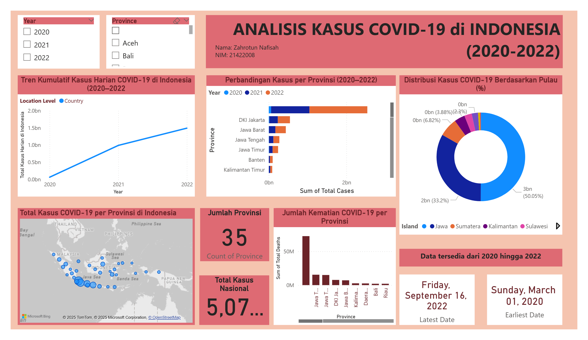
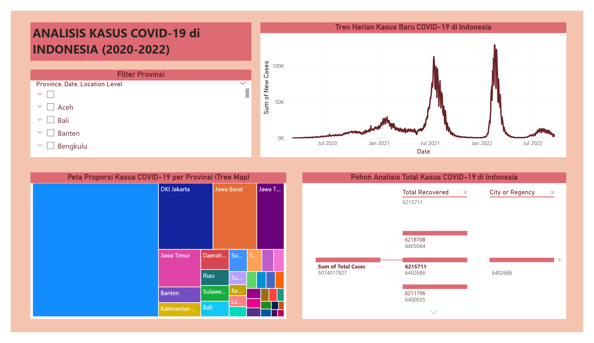

# COVID-19 Indonesia Analysis (2020–2022)
### Data Visualization & Business Intelligence Dashboard using Power BI


---

## Project Description

This project presents an interactive Power BI dashboard analyzing COVID-19 case trends across 34 provinces in Indonesia from March 2020 to September 2022. The dashboard provides insights into daily case trends, provincial comparisons, island-level distributions, and mortality rates to support data-driven public health understanding.

---

## Dataset

| Aspect | Detail |
|--------|--------|
| **Source** | Kaggle — COVID-19 Indonesia Time Series |
| **Size** | 31,822 rows × 38 columns |
| **Coverage** | 34 provinces, March 2020 — September 2022 |
| **Key Columns** | Date, Province, Island, Total Cases, New Cases, Total Deaths, Total Recovered, Case Fatality Rate |

---

## Tools Used

- **Power BI Desktop** — dashboard & interactive visualization
- **Power Query** — data cleaning & transformation

---

## Dashboard Overview

The dashboard consists of the following visualizations:

- Line Chart — cumulative daily COVID-19 case trends (2020–2022)
- Bar Chart — provincial case comparison per year
- Donut Chart — case distribution by island (%)
- Map — geographic spread of cases across Indonesia
- Tree Map — proportional case distribution per province
- KPI Cards — total national cases, number of provinces, date range

---

## Key Insights

- DKI Jakarta recorded the highest total cases at 1,412,511
- Pulau Jawa dominated with 50.05% of total national cases
- Total national cases reached 6,405,044 with 157,876 total deaths
- Case growth accelerated significantly in 2021, driven by the Delta variant wave
- Jawa Timur and Jawa Tengah ranked among the highest in total deaths per province

---

## Dashboard Preview

**Page 1 — Overview Dashboard**


**Page 2 — Detail & Tree Map**


---

## Repository Structure

```
covid19-indonesia-analysis/
│
├── covid_19_indonesia_time_series_all.csv   # Dataset
├── dashboard_preview.png                    # Dashboard screenshot
└── README.md                                # Project documentation
```

---

## Author

**Zahrotun Nafisah**
Information Systems Student — Universitas Nahdlatul Ulama Sidoarjo
LinkedIn: https://www.linkedin.com/in/zahrotun-nafisah
